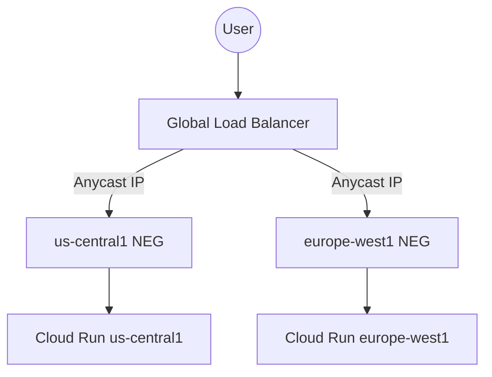

# 🌍 MULTI-REGION DEPLOYMENT GUIDE

**Classification:** CONFIDENTIAL - INTERNAL ONLY  
**Applies to:** Enterprise Tier Load Balancing  

This document explains how to configure GCP Global Load Balancing for the multi-region Cloud Run deployment enabled by `deploy-service.sh`.

---

## 1. Network Topology

We utilize a **Global Exterior Application Load Balancer** with **Network Endpoint Groups (NEGs)** pointing to regional Cloud Run services.



---

## 2. Setup Procedure (One-Time)

### A. Create NEGs for each region
```bash
gcloud compute network-endpoint-groups create ai-calling-neg-us \
    --region=us-central1 \
    --network-endpoint-group-type=serverless \
    --cloud-run-service=dentacore-ai-calling

gcloud compute network-endpoint-groups create ai-calling-neg-eu \
    --region=europe-west1 \
    --network-endpoint-group-type=serverless \
    --cloud-run-service=dentacore-ai-calling
```

### B. Create Backend Service
```bash
gcloud compute backend-services create ai-calling-backend-global \
    --load-balancing-scheme=EXTERNAL_MANAGED \
    --global
```

### C. Add regional NEGs to the Backend Service
```bash
gcloud compute backend-services add-backend ai-calling-backend-global \
    --global \
    --network-endpoint-group=ai-calling-neg-us \
    --network-endpoint-group-region=us-central1

gcloud compute backend-services add-backend ai-calling-backend-global \
    --global \
    --network-endpoint-group=ai-calling-neg-eu \
    --network-endpoint-group-region=europe-west1
```

---

## 3. Deployment Flow

1. Run `./deploy-service.sh [PROJECT_ID]`. 
2. This creates a `green` revision in all target regions.
3. Test the green revision at the regional URLs.
4. Promote traffic in each region using the commands provided at the end of the script.
5. GCP Global Load Balancer will automatically route users to the nearest healthy region.

---

## 4. Failover Logic

GCP performs active health checks. If an entire region (e.g., `us-central1`) goes offline, the Load Balancer will automatically steer 100% of traffic to the next closest healthy region (`us-east1` or `europe-west1`). 

**Note:** WebSocket connections currently in-progress during a regional failure will disconnect and require reconnecting to the new region. Use the `ConnectionManager` retry logic in the client.
