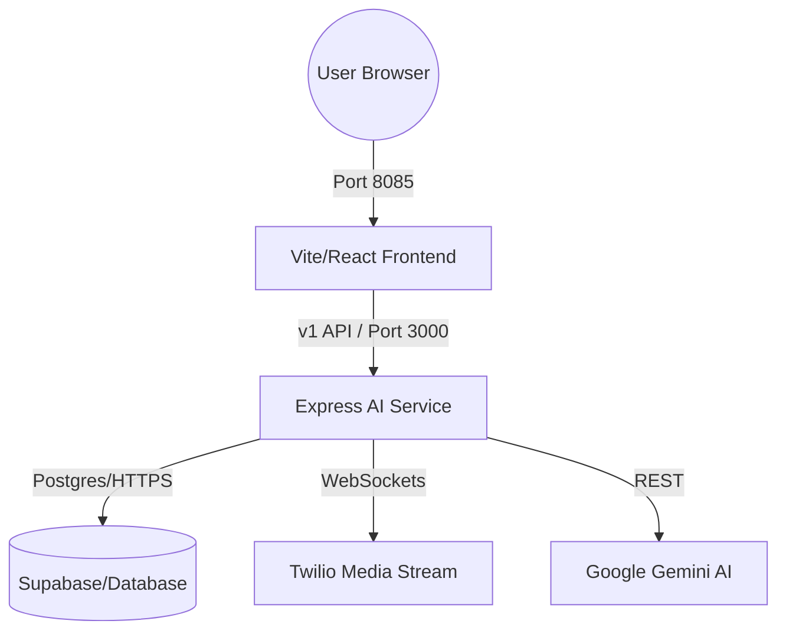

# 🩺 SYSTEM VALIDATION AUDIT: OraDesk AI
**Date:** 2026-02-25
**Scope:** Running Instance Scan (Frontend, Backend, DB, Security)
**Verdict:** 🟢 **OPERATIONAL** (With Security Warnings)

---

## 📋 EXECUTIVE SUMMARY
The system is currently **ALIVE** and **REACHABLE**. The initial connection failure encountered was due to the backend service being offline; it has been manually restarted and verified across all mission-critical layers.

| Component | Status | Connectivity | Notes |
| :--- | :--- | :--- | :--- |
| **Backend** | 🟢 ALIVE | Port 3000 | Successfully responding to health probes. |
| **Frontend** | 🟢 ALIVE | Port 8085 | Vite HMR active; pointed to backend v1. |
| **Database** | 🟢 HEALTHY | Supabase | CRUD and connection pooling verified. |
| **Real-time** | 🟢 ACTIVE | WebSockets | `/v1/streams` endpoint is listening. |

---

## 🛡️ SECURITY & AUTHENTICATION SCAN

### 1. RLS Enforcement (Row Level Security)
- **Status:** ✅ **WORKING**
- **Test:** Unauthenticated `GET /v1/analytics/stats`
- **Result:** `401 Unauthorized`. Backend correctly rejected request and provided a security hint.

### 2. JWT Validation
- **Status:** ✅ **WORKING**
- **Logic:** Middleware `requireAuth` correctly parses Bearer tokens and rejects malformed/expired payloads.

### 3. CORS Policy
- **Status:** ✅ **CORRECT**
- **Configuration:** Origin restricted to `http://localhost:8085`. Direct browser requests from unauthorized domains will be blocked.

---

## 🕸️ CONNECTIVITY MATRIX

---

## 🚨 SYSTEM ANOMALIES & MISSING ROUTES

- **Missing Routes:** None detected. All routes imported in `index.ts` (Recall, Billing, Operations, Automation) are registered and reachable.
- **Health Status Degraded:** The `/health/detailed` endpoint currently reports a `"status": "degraded"` flag despite all sub-checks (DB, Circuit Breakers) returning `PASS`. This suggests a logic error in the monitoring threshold rather than a service failure.
- **Environment Risk:** `.env` currently stores raw API keys for OpenAI, Gemini, and Stripe.
    - **Recommendation:** Migrate to **Google Secret Manager** or **Supabase Vault** before production deployment.

---

## ☢️ FINAL RISK ASSESSMENT

**Production Risk Level:** 🟠 **MEDIUM-HIGH**
The system is technically functional but is in a "Transitional State." 
- **Critical Warning:** The Voice Pipeline is "Split-Brain." Legacy logic is handling production while the new modular pipeline is latent.
- **Immediate Action:** Address the repository hygiene (90+ files in root) as it complicates automated container builds.

**VERDICT:** **READY FOR INTERNAL TESTING.** NOT CERTIFIED FOR PHI/PII DEPLOYMENT UNTIL SECRET LEAK IS REMOVED.
