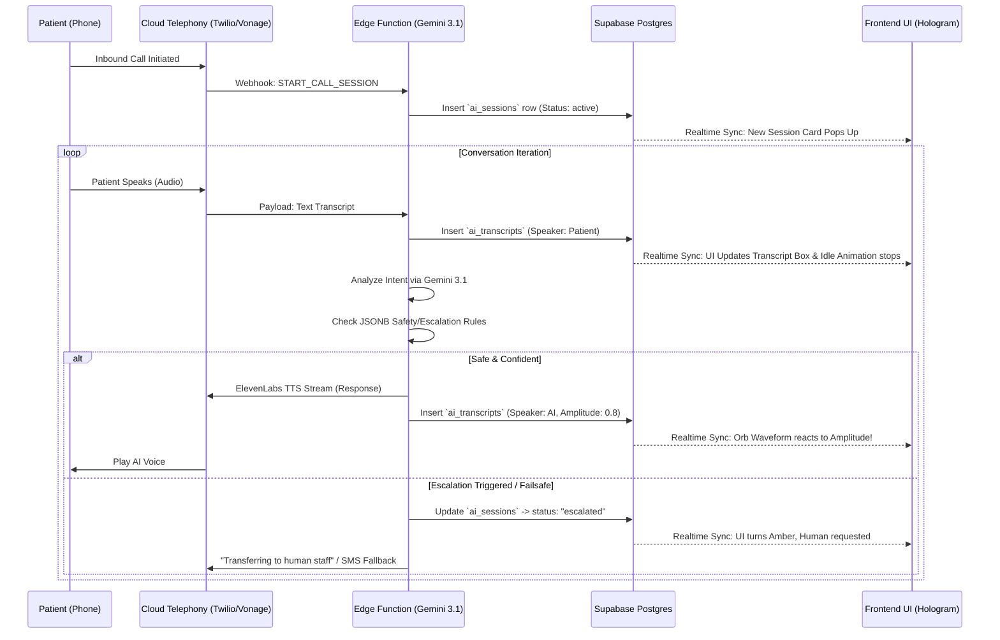

# Production Blueprint: Clinical AI Control Center

## 1. Realtime Data Flow Diagram
Below is the system communication mapping between Frontend (React), Backend (Supabase + Edge Functions), and AI Models (Gemini + ElevenLabs).



## 2. Hologram Animation Logic Pseudo-Code
The frosted glass AI orb reacts dynamically to the incoming database metrics over Supabase Realtime mapping amplitude values into CSS properties.

```typescript
import { useEffect, useState } from 'react';
import { supabase } from '@/lib/supabase'; // Assuming setup

// Pseudo-logic to apply to UI Component
export function useHologramState(sessionId: string) {
  const [orbState, setOrbState] = useState<'IDLE' | 'LISTENING' | 'SPEAKING'>('IDLE');
  const [waveHeight, setWaveHeight] = useState(10); // px
  
  useEffect(() => {
    // Subscribe to Transcript insertions
    const subscription = supabase
      .channel('public:ai_transcripts')
      .on('postgres_changes', { event: 'INSERT', schema: 'public', table: 'ai_transcripts', filter: `session_id=eq.${sessionId}` }, (payload) => {
        const { speaker, amplitude } = payload.new;
        
        if (speaker === 'patient') {
          setOrbState('LISTENING');
          // Smoothly scale up a listening ring, pause breathing
          animateListeningRing(true);
        } else if (speaker === 'ai') {
          setOrbState('SPEAKING');
          // Amplitude ranges 0.0 to 1.0 (from ElevenLabs/Twilio stream parsing)
          // Map amplitude to CSS waveform height: base 10px + (amplitude * 60px)
          const newHeight = 10 + (amplitude * 60);
          setWaveHeight(newHeight);
        }
      })
      .subscribe();

    return () => { supabase.removeChannel(subscription); }
  }, [sessionId]);

  return { orbState, waveHeight };
}

/* CSS Implementation Details:
  - Base Orb: `backdrop-blur-md bg-white/30 border border-white/60 box-shadow: 0 8px 32px rgba(13,94,94,0.08)`
  - Idle state: CSS keyframes `scale(1) to scale(1.05)` over 3000ms.
  - Active wave: Internal div with `height: ${waveHeight}%` and css transition `height 0.15s ease-out` for snappy latency reflection.
*/
```

## 3. Role-Based Access Rules Matrix

Access control enforces Zero Trust on the Frontend utilizing Supabase RLS policies via custom Claims or `user_roles` linking tables.

| Action / Entity | `admin` (Owner) | `dentist` (Provider) | `frontdesk` (Staff) | `anon` (Public) |
|---|---|---|---|---|
| View `clinics` Base Data | Yes | Yes | Yes | **Blocked** |
| Update `clinic_settings` JSONB | Yes | Yes | **Blocked** | **Blocked** |
| Configure MCP Integration Keys | Yes | **Blocked** | **Blocked** | **Blocked** |
| Listen to Realtime Transcripts | Yes | Yes | Yes | **Blocked** |
| Override "Escalate to Human" | Yes | Yes | Yes | **Blocked** |
| Export `ai_metrics_daily` | Yes | Yes | **Blocked** | **Blocked** |

*Note: The Supabase JWT token must inject the `clinic_id` onto the context session to authorize fetching logic across Edge Functions automatically.*

## 4. Production Release Checklist

### Phase 1: Database & Schema
- [ ] Run `01_schema.sql` via Supabase Studio or CLI.
- [ ] Ensure Row-Level Security (RLS) is fully active on all 5 tables (`clinics`, `clinic_settings`, `ai_sessions`, `ai_transcripts`, `ai_metrics_daily`).
- [ ] Seed development user utilizing `admin` role in `user_roles` linking table.
- [ ] Enable Realtime for `ai_transcripts` in Supabase dashboard.

### Phase 2: Compute Edge Functions
- [ ] Compile Edge Function using `deno bundle` targeting `index.ts`.
- [ ] Deploy Edge Function utilizing command: `supabase functions deploy ai-session --no-verify-jwt`. (*Ensure internal API key validation if exposing to Twilio/Vonage raw webhooks*).
- [ ] Bind environment secrets: `SUPABASE_URL`, `SUPABASE_SERVICE_ROLE_KEY`, `GEMINI_API_KEY`, `ELEVENLABS_KEY`.

### Phase 3: Frontend Deployment (Vite + React)
- [ ] Verify tailwind build processes correctly.
- [ ] Test the `Intelligence.tsx` mock state offline rendering flawlessly.
- [ ] Confirm no neon colors remain. Check color contrasts across `.bg-[#0d5e5e]` for WCAG AAA accessibility scores on headings.
- [ ] Run TypeScript linting `npx tsc --noEmit` and `eslint`. 
- [ ] Hook React Query to Supabase REST endpoints instead of Mock state.

### Phase 4: Failsafe Testing Protocols
- [ ] Disable Internet connectivity locally while running mock test → confirm Frontend shows "Offline Mode" Queue tag.
- [ ] Force a 500 status from Gemini Model integration → verify Edge function returns SMS sequence trigger rather than crashing session.
- [ ] Attempt un-authorized cross-clinic query on PostgREST (RLS Verification test).
