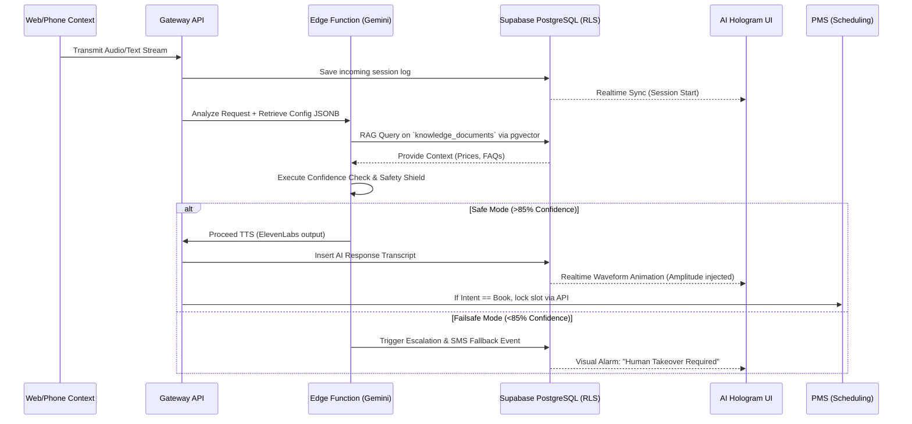

# Deployment Guide: Clinical AI Operating Infrastructure

## 1. Realtime Data Flow Diagram (RAG + Outbound/Inbound Logic)



## 2. Widget Customization Logic

The Web Agent (Deployment Tab) provides a vanilla JS script payload configurable via JSONB stored in `clinic_settings`.

```html
<!-- Inside the Website Header -->
<script src="https://cdn.oradesk.com/widget-v2.js"></script>
<script>
  window.OraAIConfig = {
    clinicId: "UUID-FROM-DASHBOARD",
    features: { voice: true, chat: true },
    brandHex: "#0d5e5e",
    greeting: "Hi! I'm your clinic's AI assistant. Do you need to book an appointment?",
    delaySeconds: 5 // Delay before auto-expand
  };
</script>
```
**Mechanism:** `widget-v2.js` attaches a React shadow-dom instance fetching the `features` object mapped dynamically to the database table schema `clinic_settings.deployment_jsonb` to lock rendering restrictions instantly.

## 3. Role-Based Access Policies

* `dentist` (Owner): Can modify everything, see billing, and access all sessions.
* `admin` (Manager): Same as Dentist, but cannot permanently delete the clinic or alter base plans.
* `frontdesk` (Operator): View-Only across settings, full access to live `ai_sessions` and `ai_transcripts` to monitor real-time caller needs and force human-takeover. Unallowed to alter AI behavior sliders.

| Action / Entity | `admin` (Owner) | `dentist` (Provider) | `frontdesk` (Staff) |
|---|---|---|---|
| View `clinics` Base Data | Yes | Yes | Yes |
| Update `clinic_settings` JSONB | Yes | Yes | **Blocked** |
| Upload Knowledge PDFs | Yes | Yes | **Blocked** |
| Force "Human Takeover" | Yes | Yes | Yes |
| View `ai_metrics_daily` | Yes | Yes | **Blocked** |

## 4. Hologram Animation Logic
The AI Core UI utilizes CSS transforms responding to 2 states streamed from Supabase Realtime Channels.
- **IDLE State:** Orb applies `animate-pulse duration-[3000ms]`. Background is low-opacity `#0d5e5e`.
- **ACTIVE (Speaking) State:** Orb scales up `scale-150` with heavier shadow blur mapped to `#0d5e5e/30`. `backdrop-blur-md` activates to emulate frosted glass.

If an Emergency or Escalate is triggered (Realtime JSON `{"status": "escalated"}`), UI instantly applies `from-red-500/10` gradient backgrounds and `ring-red-200` to alert staff intuitively without screen refreshes.

## 5. Deployment Checklist
### Frontend React
- [ ] Merge `ClinicalAIOperations.tsx` layout components.
- [ ] Connect Lucide icons.
- [ ] Hook the "Test Voice" button to the internal Twilio/Browser simulator.

### Backend Infrastructure
- [ ] Execute `04_full_system_schema.sql` into the Supabase project instance (via SQL studio).
- [ ] Verify `pgvector` extension is enabled prior to document ingestion.
- [ ] Trigger Postgres Cron `/ai_metrics_daily` aggregator rollups.
- [ ] Run `deno bundle` targeting `05_edge_functions.ts`.
- [ ] Set `GEMINI_API_KEY`, `ELEVENLABS_API_KEY` in Supabase Secrets vault.

### Realtime Testing
- [ ] Trigger an Emergency Keyword locally through the console → Watch Hologram turn Red.
- [ ] Upload mock `.pdf` Knowledge file → Ensure table row adds "URL Extractor" label.
- [ ] Set Voice Slider down to 10% → Validate the DB JSONB payload receives exact value mapping.
